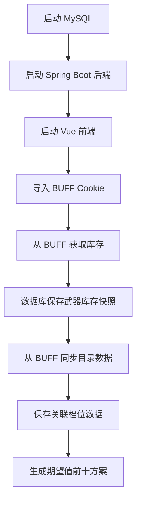
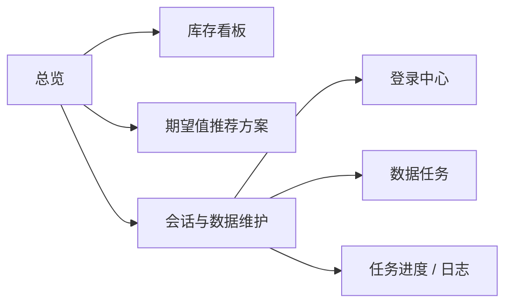

# CS 汰换工作台

基于 BUFF 账号库存数据，自动保存炼金素材库存、同步市场目录数据，并按期望值推荐 CS 汰换方案。

当前项目由两部分组成：

- 后端：`Spring Boot + Maven + Java 8`
- 前端：独立 `Vue 3 + Element Plus` 项目

## 项目能力

- 前端导入 BUFF Cookie，后端托管会话，不再需要在 `application.yml` 手动配置 session。
- 库存抓取会写入 MySQL，并只保留 `category_key` 以 `weapon_` 开头的武器类物品。
- 库存展示按单件饰品展示，不折叠同名物品，保留图片、中文名、磨损阶段、磨损度、收藏品、品质等字段。
- 库存抓取和目录同步是异步任务，前端可查看任务进度、当前页数、处理数量、限流提示和任务日志。
- 目录数据从 BUFF/数据库生成并落库到 `catalog_skin`，方案计算不再依赖本地 `catalog.json`。
- 方案计算默认展示期望值前十，并支持常规 10 合 1 与 `covert -> gold` 五合一规则。

## 使用流程图



## 快速启动

### 后端

```bash
mvn spring-boot:run
```

默认后端地址：

```text
http://localhost:8080
```

### 前端

```bash
cd frontend
npm install
npm run dev
```

默认前端地址：

```text
http://localhost:5173
```

## 数据库配置

默认使用 MySQL 8，库名为 `cs_taihuan`，Flyway 管理表结构。

配置文件位置：

[src/main/resources/application.yml](/Users/qiaoyu/project/cs-taihuan/src/main/resources/application.yml)

核心配置示例：

```yml
spring:
  datasource:
    url: jdbc:mysql://mc-mysql:3306/cs_taihuan?characterEncoding=utf8&useSSL=false&serverTimezone=Asia/Shanghai
    username: root
    password: abc123_
  flyway:
    enabled: true
    table: co_flyway_schema_history

buff:
  base-url: https://buff.163.com
  page-size: 80
  fetch-cooldown-seconds: 180
  session:
    storage-path: data/buff-session.json

trade-up:
  sale-fee-rate: 0.025
  max-items-per-rarity: 18
  max-combinations: 25000
```

## 文档入口

- [使用手册](docs/usage-guide.md)：从登录、抓库存、同步目录到生成方案的完整图文流程。
- [汰换规则](docs/trade-up-rules.md)：方案计算公式、概率、磨损、手续费和五合一规则。
- [BUFF 饰品字段样例](docs/buff-item-sample.md)：库存字段来源、落库字段和前端展示字段说明。

## 常用页面



- `总览`：查看当前会话、库存快照、目录数据、方案数量。
- `库存`：读取数据库中最近一次保存的武器库存，支持分页。
- `方案`：生成并查看期望值前十的推荐方案。
- `数据`：导入 BUFF 会话、抓取库存、强制刷新、同步目录数据、查看任务日志。

## 常用接口

会话：

- `GET /api/buff/session/status`
- `POST /api/buff/session/import`
- `POST /api/buff/session/validate`
- `DELETE /api/buff/session`

异步任务：

- `GET /api/tasks/{taskId}`
- `POST /api/buff/inventory/fetch/task`
- `POST /api/buff/inventory/fetch/force/task`
- `POST /api/catalog/sync/task`

库存和方案：

- `POST /api/buff/inventory/page`
- `POST /api/trade-up/next-tier/persist`
- `POST /api/trade-up/optimize`

## 注意事项

- 首次使用需要先导入 BUFF Cookie，再抓取库存。
- 首次生成方案前，需要先同步目录数据并保存关联档位数据。
- BUFF 接口可能限流，系统会在分页或详情请求之间主动等待，并在前端展示任务进度。
- Cookie 过期后需要重新从浏览器复制并导入。
- 字段逻辑调整后，旧库存快照不会自动补齐新字段，建议重新抓取库存。
