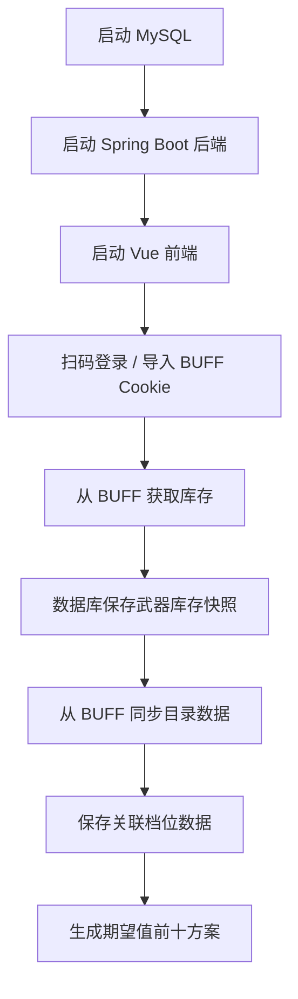
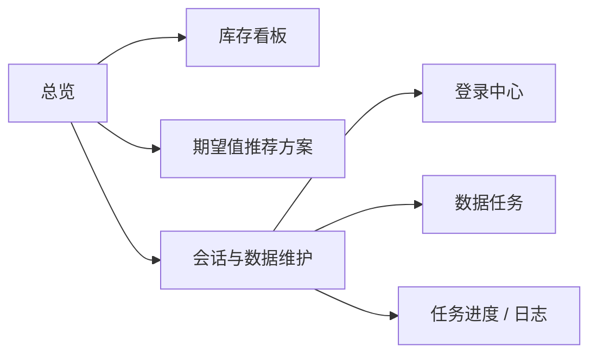

# CS 汰换工作台

基于 BUFF 账号库存数据，自动保存炼金素材库存、同步市场目录数据，并按期望值推荐 CS 汰换方案。

当前项目由两部分组成：

- 后端：`Spring Boot + Maven + Java 8`
- 前端：独立 `Vue 3 + Element Plus` 项目

## 项目能力

- 前端支持网易 BUFF App 扫码登录或手动导入 Cookie，后端托管会话，不再需要在 `application.yml` 手动配置 session。
- 库存抓取会写入 MySQL，并只保留 `category_key` 以 `weapon_` 开头的武器类物品。
- 库存展示按单件饰品展示，不折叠同名物品，保留图片、中文名、磨损阶段、磨损度、收藏品、品质等字段。
- 库存抓取和目录同步是异步任务，前端可查看任务进度、当前页数、处理数量、限流提示和任务日志。
- 目录数据从 BUFF/数据库生成并落库到 `catalog_skin`，方案计算不再依赖本地 `catalog.json`。
- 方案计算支持 EV、利润、ROI、投入成本、档位排序，以及常规 10 合 1 与 `covert -> gold` 五合一规则。
- `covert -> gold` 会区分普通和 StatTrak：普通可匹配刀/手套，StatTrak 只允许可通向暗金刀的隐秘下级；暗金手套下级不可汰换。
- 产出磨损用**归一化平均**公式（与 BUFF 汰换模拟同口径，实测一致到小数第 7 位），磨损档名按绝对磨损直接判定。
- 材料按**磨损精估市值**计价（BUFF 挂单 + 磨损子区间过滤）：拉库存后后台线程自动精估、限流冷却续跑；方案页展示「磨损价 + 档底价」两个价，另有按方案兜底精估按钮。
- 方案产物池不全时可一键**补全收藏品产物**（从内置全量名单找缺口、按名搜 BUFF 补抓全部磨损档）。
- **收藏品图鉴**页展示 90+ 收藏品的全部产物、皮肤图标、Min/Max Float 与收藏品上线时间；数据来自内置离线快照，启动自动增量导入。

## 使用流程图



## 快速启动

### 后端

```bash
mvn spring-boot:run
```

默认后端地址：

```text
http://localhost:8080
```

### 前端

```bash
cd frontend
npm install
npm run dev
```

默认前端地址：

```text
http://localhost:5173
```

## 数据库与基准数据

默认使用 MySQL 8，库名为 `cs_taihuan`。**Flyway 只管理表结构（DDL），不管数据**：

- 业务数据（库存快照、目录价格、精估价）由运行时抓取/计算落库。
- 基准数据（皮肤磨损范围、图标、收藏品上线时间）内置在 `src/main/resources/data/skin-float-range.json` 离线快照中，应用启动时自动 seed / 增量补新行（`SkinFloatRangeServiceImpl.seedIfEmpty`）。更新基准数据改快照文件即可，无需写 Flyway 迁移；改动前先备份到 `data/backup/`。

配置文件位置：

[src/main/resources/application.yml](/Users/qiaoyu/project/cs-taihuan/src/main/resources/application.yml)

核心配置示例：

```yml
spring:
  datasource:
    url: jdbc:mysql://mc-mysql:3306/cs_taihuan?characterEncoding=utf8&useSSL=false&serverTimezone=Asia/Shanghai
    username: root
    password: abc123_
  flyway:
    enabled: true
    table: co_flyway_schema_history

buff:
  base-url: https://buff.163.com
  page-size: 80
  fetch-cooldown-seconds: 180
  session:
    storage-path: data/buff-session.json

trade-up:
  sale-fee-rate: 0.025
  max-items-per-rarity: 18
  max-combinations: 25000
  output-price-factors: {}
  output-price-bands: {}
```

## 文档入口

- [使用手册](docs/usage-guide.md)：从登录、抓库存、同步目录到生成方案的完整图文流程。
- [汰换规则](docs/trade-up-rules.md)：方案计算公式、概率、磨损、手续费和五合一规则。
- [开发规范](docs/development-guidelines.md)：代码注释、错误文案、测试、目录同步和提交前检查约定；agent 开发也按此规范执行。
- [BUFF 饰品字段样例](docs/buff-item-sample.md)：库存字段来源、落库字段和前端展示字段说明。

## 常用页面



- `总览`：查看当前会话、库存快照、目录数据、方案数量。
- `库存`：读取数据库中最近一次保存的武器库存，支持分页。
- `方案`：生成并查看前十推荐方案，支持按 EV、利润、ROI、投入成本、档位和合成类型筛选排序。
- `数据`：扫码登录或导入 BUFF 会话、抓取库存、强制刷新、同步目录数据、查看任务日志。
- `特殊磨损计算器`：按目标产物磨损反推下级素材平均磨损。
- `收藏品`：收藏品图鉴，按收藏品浏览全部产物、皮肤磨损范围与上线时间，支持搜索和档位筛选。
- `账号切换`：侧边栏可维护多个 BUFF 账号；点「新增」只打开登录对话框，扫码成功或保存 Cookie 后才创建账号。Cookie、库存快照和方案按账号隔离，`catalog_skin` 市场目录全局共享。

## 常用接口

会话：

- `GET /api/accounts`
- `POST /api/accounts`
- `PUT /api/accounts/{accountId}`
- `DELETE /api/accounts/{accountId}`
- `GET /api/accounts/{accountId}/session/status`
- `POST /api/accounts/{accountId}/session/import`
- `POST /api/accounts/{accountId}/session/validate`
- `DELETE /api/accounts/{accountId}/session`
- `GET /api/buff/session/status`
- `POST /api/buff/session/import`
- `POST /api/buff/session/validate`
- `DELETE /api/buff/session`

扫码登录（`accountId` 省略时为「新增」流程，登录成功后由后端创建账号）：

- `POST /api/buff/login/qrcode/start`、`GET /api/buff/login/qrcode/status`、`POST /api/buff/login/qrcode/cancel`
- `POST /api/accounts/{accountId}/login/qrcode/start`、`GET /api/accounts/{accountId}/login/qrcode/status`、`POST /api/accounts/{accountId}/login/qrcode/cancel`

异步任务：

- `GET /api/tasks/{taskId}`
- `POST /api/accounts/{accountId}/inventory/fetch/task`
- `POST /api/accounts/{accountId}/inventory/fetch/force/task`
- `POST /api/accounts/{accountId}/catalog/sync/task`
- `POST /api/buff/inventory/fetch/task`
- `POST /api/buff/inventory/fetch/force/task`
- `POST /api/catalog/sync/task`

库存和方案：

- `POST /api/accounts/{accountId}/inventory/page`
- `POST /api/accounts/{accountId}/inventory/refine-float-prices`（按磨损精估指定材料市值）
- `POST /api/accounts/{accountId}/trade-up/next-tier/persist`
- `POST /api/accounts/{accountId}/trade-up/optimize`
- `POST /api/accounts/{accountId}/catalog/backfill-outcomes`（补全收藏品产物档）
- `POST /api/buff/inventory/page`
- `POST /api/trade-up/next-tier/persist`
- `POST /api/trade-up/optimize`

基准库与图鉴：

- `GET /api/skin-float-range/collections`（收藏品图鉴：产物、磨损范围、上线时间）
- `POST /api/skin-float-range/import`、`GET /api/skin-float-range/stats`

## 注意事项

- 首次使用需要先扫码登录或导入 BUFF Cookie，再抓取库存。
- 扫码登录依赖后端用 Playwright 打开 BUFF 登录页，需安装对应浏览器（`PLAYWRIGHT_SKIP_BROWSER_DOWNLOAD` 未设时会自动下载）。
- 首次生成方案前，需要先同步目录数据并保存关联档位数据。
- BUFF 接口可能限流，系统会在分页或详情请求之间主动等待，并在前端展示任务进度。
- Cookie / 扫码会话过期后需要重新登录。
- 字段逻辑调整后，旧库存快照不会自动补齐新字段，建议重新抓取库存。
