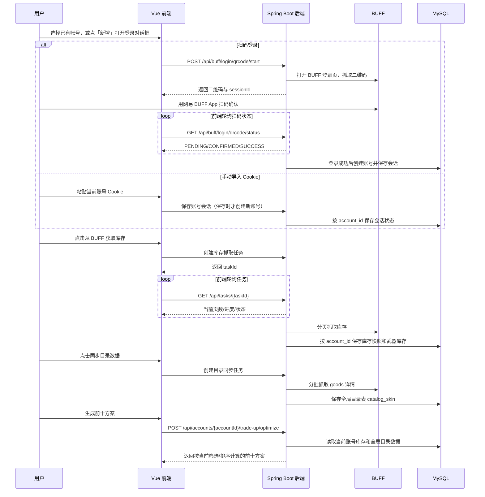
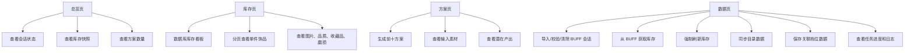
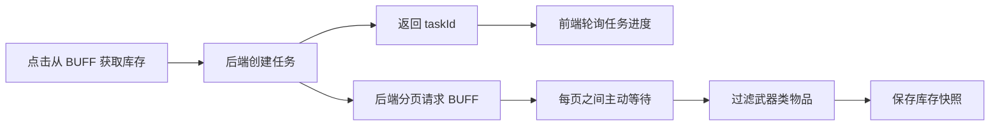
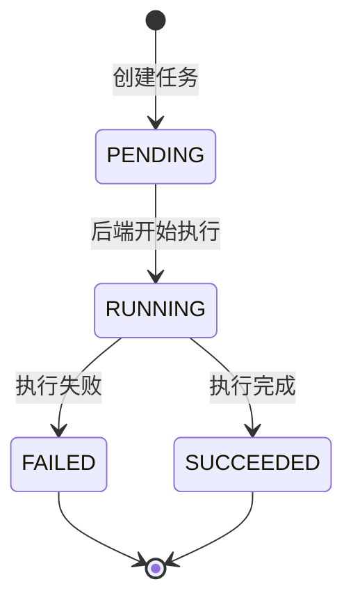

# 使用手册

这份文档按实际操作顺序说明如何使用 CS 汰换工作台：登录 BUFF、抓取库存、同步目录数据、保存关联档位数据、生成推荐方案。

## 一张图看懂流程



## 1. 准备环境

### 依赖

- Java 8
- Maven
- Node.js 18+
- MySQL 8.0.21+

### 数据库

项目默认数据库名为：

```text
cs_taihuan
```

Flyway 会在后端启动时自动执行迁移脚本，历史表为：

```text
co_flyway_schema_history
```

如果后端启动时报数据库连接失败，优先检查：

- MySQL 容器或服务是否已启动
- `src/main/resources/application.yml` 中的地址、账号、密码是否正确
- 数据库 `cs_taihuan` 是否存在

### 多账号数据边界

- `buff_account`、`buff_session`、`inventory_snapshot`、`catalog_sync_task`、`trade_up_next_tier_item` 按 `account_id` 隔离。
- `catalog_skin` 是 BUFF 市场目录，跨账号共享，避免重复同步同一批商品数据。
- 删除账号时会一并清理该账号的会话、库存快照、目录同步任务和关联档位数据，不留孤儿记录（`catalog_skin` 不受影响）。
- 老接口仍可使用，内部默认走第一个账号；新前端会优先使用 `/api/accounts/{accountId}/...`。

## 2. 启动项目

### 启动后端

在项目根目录执行：

```bash
mvn spring-boot:run
```

后端默认监听：

```text
http://localhost:8080
```

### 启动前端

进入前端目录：

```bash
cd frontend
npm install
npm run dev
```

前端默认访问：

```text
http://localhost:5173
```

## 3. 页面导览



### 总览页

总览页用于快速判断当前系统状态：

- BUFF 会话是否有效
- 是否已经有库存快照
- 目录数据是否就绪
- 是否已经生成过推荐方案

### 库存页

库存页只展示数据库中已经保存的库存，不直接抓取 BUFF。

展示字段包括：

- 饰品图片
- 中文名称
- 价格
- 品质
- 收藏品
- 磨损阶段
- 磨损度
- 是否可交易

如果库存页没有数据，需要先到 `数据页` 点击 `从 BUFF 获取库存`。

### 方案页

方案页用于生成推荐合同。

当前默认行为：

- 后端读取最近一次数据库库存快照
- 后端读取数据库中的目录数据
- 前端默认展示期望值前十的方案
- 可按期望值、利润、ROI、投入成本、档位排序
- 可按档位、普通/StatTrak、常规合成/Gold 合成筛选
- 点击方案后可查看输入素材和潜在产出

### 数据页

数据页是所有长任务入口：

- `扫码 / 导入会话`：打开登录对话框，支持网易 BUFF App 扫码登录或手动粘贴 Cookie
- `校验会话`：检查 Cookie 是否仍然有效
- `清除会话`：删除后端托管的 Cookie
- `从 BUFF 获取库存`：分页抓取 BUFF 库存并落库
- `强制刷新库存`：即使远端看起来没变，也重新抓取并保存
- `从 BUFF 同步目录数据`：按库存里的 `goods_id` 补齐市场目录数据
- `保存关联档位数据`：为方案计算补齐上级/下级冗余数据

## 4. 登录 BUFF

不再需要在后台 yml 配置 session。`数据页 -> 登录中心 -> 扫码 / 导入会话` 打开登录对话框，提供两种方式。

> 点「新增」只是打开登录对话框，**不会立即创建账号**。只有扫码登录成功、或手动保存 Cookie 时才会创建账号；中途关闭对话框不会留下空账号。

### 方式一：扫码登录（推荐）

1. 打开登录对话框，默认在「扫码登录」标签页。
2. 点「获取登录二维码」，后端会自动打开 BUFF 登录页并抓取二维码。
3. 用网易 BUFF App 扫码并确认。
4. 登录成功后，后端保存会话并自动创建/绑定账号，前端切换到该账号。

> 扫码需要后端服务器能访问 BUFF 登录页。若服务器网络受限，请改用手动导入。

### 方式二：手动导入 Cookie

1. 打开浏览器并登录 BUFF，打开开发者工具的 `Network` 面板。
2. 刷新 BUFF 页面或点开任意 BUFF 请求，在请求头里找到 `Cookie` 并复制完整字符串。
3. 在登录对话框切到「手动导入」标签页，粘贴 Cookie 并保存。

注意：

- Cookie 是敏感信息，不要提交到 Git。
- Cookie / 扫码会话过期后，需要重新登录。
- 如果校验失败，通常是 Cookie 不完整或 BUFF 登录态过期。

## 5. 抓取库存

在 `数据页` 点击：

```text
从 BUFF 获取库存
```

系统会创建异步任务，而不是让浏览器一直等待一个超长请求。



库存落库口径：

- 只保存 `category_key` 以 `weapon_` 开头的武器类物品
- 相同物品不折叠，按单件饰品保存
- `asset_id` 用来区分每一件具体库存
- `float_value_raw` 用于保留原始磨损精度
- `raw_json` 用于保留 BUFF 原始返回，便于排查字段变化

## 6. 查看任务进度

库存抓取和目录同步都可能持续几分钟。前端数据页会展示任务进度和日志。



任务区会展示：

- 任务类型
- 当前状态
- 进度百分比
- 当前页数或已处理数量
- 限流提示
- 错误信息
- 最近任务日志

如果 BUFF 返回 `429 Too Many Requests`：

- 库存抓取会尽量回退到最近一次数据库快照
- 目录同步会保留已经写入的数据
- 前端会提示稍后可以继续同步

## 7. 同步目录数据

生成方案前需要同步目录数据。

在 `数据页` 点击：

```text
从 BUFF 同步目录数据
```

目录同步会做这些事：

- 读取当前库存快照里的 `goods_id`
- 请求 BUFF 商品详情
- 提取目标皮肤、价格、磨损区间、品质、收藏品、上级来源
- 递归补抓 `relative_goods`
- 写入目录表 `catalog_skin`

为了减少限流，每个 goods 详情请求之间会主动等待。一次同步如果没有全部完成，可以稍后再次点击，系统会跳过已经入库的数据。

## 8. 保存关联档位数据

目录数据同步后，建议点击：

```text
保存关联档位数据
```

这个操作会根据数据库里的库存和目录数据，补齐方案计算需要的上级/下级冗余数据。

如果跳过这一步，可能出现：

- 方案数量为 0
- 某些收藏品找不到下一档产物
- `covert -> gold` 的金色产物匹配不完整
- StatTrak 隐秘下级属于手套路径，无法参与暗金红转金

## 9. 生成推荐方案

进入 `方案页`，点击：

```text
生成前十方案
```

系统会默认请求前 10 条推荐方案，排序和筛选会随方案页当前控件一起提交给后端。

计算依赖：

- 数据库库存快照
- 数据库目录数据
- 关联档位数据
- 汰换规则和手续费配置

方案列表默认按期望值排序，也可以切换为利润、ROI、投入成本或档位排序。点击任意方案后，可以查看：

- 合同输入素材
- 输入成本
- 期望值
- 预计利润
- 潜在产出
- 每个产物概率和估算价格

价格估算会先计算每个产物的精确磨损。若 `trade-up.output-price-bands` 配置了 BUFF 细磨损档，例如久经 `0.15-0.18` 和 `0.18-0.21` 两档不同价，系统会优先按精确磨损命中细档价格，再回退到目录同步的大磨损档价格。

`covert -> gold` 特殊说明：

- 普通隐秘输入可以匹配对应箱源下的刀和手套。
- StatTrak 隐秘输入只允许使用可通向暗金刀的下级。
- 暗金手套下级无法参与汰换，不能和暗金刀下级混入同一份合同。

## 10. 特殊磨损计算器与磨损范围基准库

磨损页按目标产物自身的 Min/Max Float 反推下级素材需要的平均磨损。为保证任意皮肤都有可靠的磨损范围，项目内置了一份**全量皮肤磨损范围基准库**。

- 数据来源：开源数据集 [ByMykel/CSGO-API](https://github.com/ByMykel/CSGO-API) 的中英文 `skins.json`，按皮肤 `id` 合并出双语名 + 共享的 `min/max float`，精简快照内置在 `src/main/resources/data/skin-float-range.json`，**完全离线**，不依赖运行时联网。
- 存储与导入：导入到独立表 `skin_float_range`；表为空时启动自动 seed，也可手动 `POST /api/skin-float-range/import` 重导，`GET /api/skin-float-range/stats` 查看条数。
- 磨损范围取值优先级：BUFF 目录真实值 → 基准库（当目录缺失或退化成 `0.0~1.0` 时）→ 都没有则报错（不再用错误的 `0~1` 默认值算出错误结果）。
- 目标搜索：支持**按收藏品 + 按名称分字段搜索**，覆盖范围为「BUFF 目录 ∪ 基准库」，因此没同步过目录、但基准库里有的皮肤也能作为计算目标。结果会标注磨损范围来源（目录 / 基准库）。
- 更新数据：从数据源重新拉取中英文 `skins.json`，合并生成精简快照替换内置文件后，调用 `/api/skin-float-range/import` 重导即可。

## 11. 常见问题

### 为什么库存页没有数据？

先确认是否已经在数据页成功执行过 `从 BUFF 获取库存`。库存页只读数据库，不直接抓 BUFF。

### 为什么方案数量是 0？

常见原因：

- 没有库存快照
- 没有同步目录数据
- 没有保存关联档位数据
- 库存素材不可交易或缺少磨损值
- 目录数据里找不到下一档产物

### 为什么任务一直很慢？

这是预期行为。BUFF 对请求频率敏感，系统会在分页抓取和商品详情请求之间主动等待，降低 `429` 限流概率。

### 为什么同步目录数据会部分完成？

目录同步会递归补抓相关商品，数据量可能比较大。遇到限流或达到单次处理上限时，会保留已落库数据，后续继续同步即可。

### 为什么旧数据没有图片或磨损精度？

旧库存快照不会自动补齐新字段。字段逻辑调整后，需要重新抓取库存。

## 12. 相关文档

- [汰换规则](trade-up-rules.md)
- [BUFF 饰品字段样例](buff-item-sample.md)
